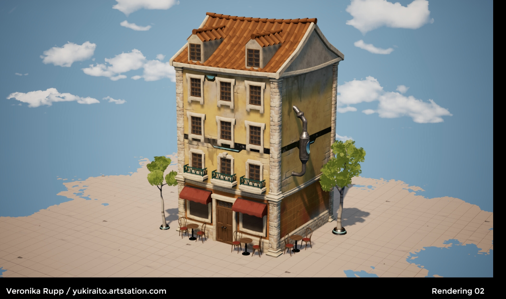

# CIS 5660 HW03 Procedural Buildings

## Demo

## Overview
In this project, I picked a pombaline architecture-style building as a reference on ArtStation: https://www.artstation.com/artwork/Vyrk25

Followed the Simon's Houdini tutorial, I implemented some basic procedural building generation nodes in Houdini and modeled windows, balcony, roof, and table sets in Maya.

Users can adjust the scale of the building on each floor, and each building will have random architecture on the side.

